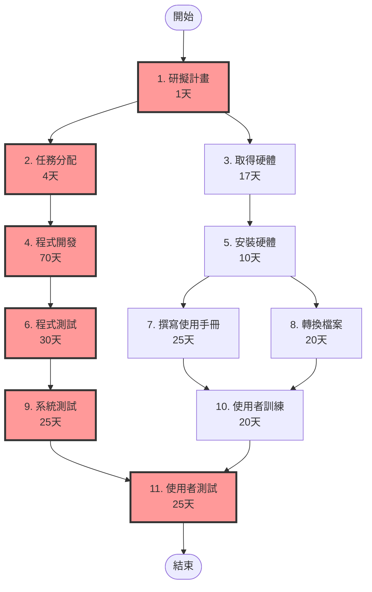
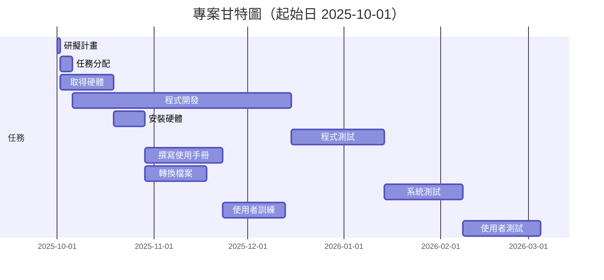

# HW2 — PERT/CPM 與甘特圖
##  任務清單
|任務編號|說明|需時(天)|前置任務|ES|EF|LS|LF|Slack|是否關鍵|
|---:|---|---:|---|---:|---:|---:|---:|---:|---:|
|1|研擬計畫|1|-|0|1|0|1|0|是|
|2|任務分配|4|1|1|5|1|5|0|是|
|3|取得硬體|17|1|1|18|58|75|57|否|
|4|程式開發|70|2|5|75|5|75|0|是|
|5|安裝硬體|10|3|18|28|75|85|57|否|
|6|程式測試|30|4|75|105|75|105|0|是|
|7|撰寫使用手冊|25|5|28|53|85|110|57|否|
|8|轉換檔案|20|5|28|48|90|110|62|否|
|9|系統測試|25|6|105|130|105|130|0|是|
|10|使用者訓練|20|7,8|53|73|110|130|57|否|
|11|使用者測試|25|9,10|130|155|130|155|0|是|

## 1. PERT/CPM 圖

## 2. 甘特圖

## 3. 關鍵路徑
**專案最早完成時間 (Project Duration)**: 155 天（起始日假設 2025-10-01）

**關鍵路徑 (Critical Path)**: 1 -> 2 -> 4 -> 6 -> 9 -> 11

##  任務起訖時間（起始日 2025-10-01）
|任務|說明|開始日期|結束日期|
|---:|---|---:|---:|
|1|研擬計畫|2025-10-01|2025-10-01|
|2|任務分配|2025-10-02|2025-10-05|
|3|取得硬體|2025-10-02|2025-10-18|
|4|程式開發|2025-10-06|2025-12-14|
|5|安裝硬體|2025-10-19|2025-10-28|
|6|程式測試|2025-12-15|2026-01-13|
|7|撰寫使用手冊|2025-10-29|2025-11-22|
|8|轉換檔案|2025-10-29|2025-11-17|
|9|系統測試|2026-01-14|2026-02-07|
|10|使用者訓練|2025-11-23|2025-12-12|
|11|使用者測試|2026-02-08|2026-03-04|

